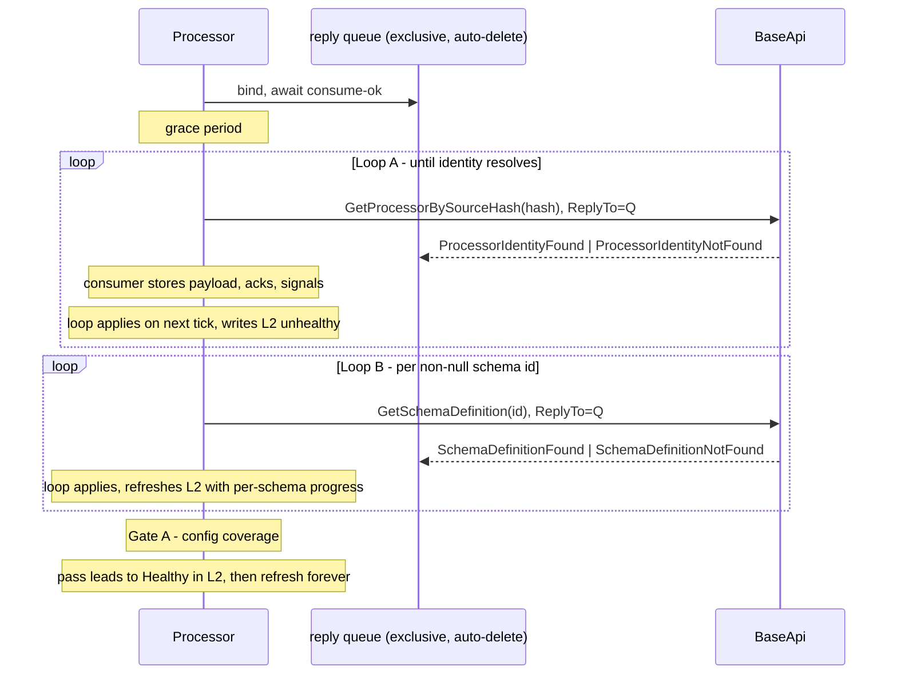

# Processor.Sample — Discovery & Liveness Slice

**Date:** 2026-08-18
**Status:** Design agreed, awaiting review before planning

## 1. Goal

Bring a processor console into `src/`: it boots, discovers its own identity from the API, resolves its schema definitions, validates that its config schema covers its concrete config type, and publishes liveness to Redis. It consumes no work.

The end state is a processor the API's orchestration-start gate can see as `Healthy` — the foundation the dispatch pipeline lands on in a later slice.

## 2. Scope

**In:** identity discovery, schema discovery, Gate A config-coverage validation, liveness heartbeat, and the metric-label deferral. Plus the processor-side request client, which is the one piece of messaging `src` does not yet have, and a test project at `src/tests/` (§13).

**Out:** all dispatch — `EntryStepDispatchConsumer`, `PostProcessConsumer`, `ProcessorPipeline`, `OutputTail`, and the `{id:D}` / `{id:D}-post` receive-endpoint binds. No MassTransit anywhere.

**Later:** a processor-side L2 gate loop mirroring `L2Gate` / `L2GateProbe` / `L2FaultClassifier`. Seams stay clean for it; nothing in this slice should have to be reshaped to admit it.

## 3. Starting position

### Already built in `src` — no new work

The entire API responder half of discovery exists and runs:

- `Messaging.Contracts/ProcessorQueues.cs` — `IdentityQuery = "processor-identity-query"`, `SchemaQuery = "schema-definition-query"`. Its own comment names the missing counterpart: "shared between the API, which binds the receive endpoints, and the processor request clients that send to them."
- `Messaging.Contracts/ProcessorQueries.cs` — `GetProcessorBySourceHash(string SourceHash)`, `ProcessorIdentityFound(Guid Id, Guid? InputSchemaId, Guid? OutputSchemaId, Guid? ConfigSchemaId, string Name, string Version)`, `ProcessorIdentityNotFound(string SourceHash)`, `GetSchemaDefinition(Guid SchemaId)`, `SchemaDefinitionFound(string Definition)`, `SchemaDefinitionNotFound(Guid SchemaId)`. The explicit not-found variants already exist: "Separate found/not-found responses let the client pattern-match."
- `BaseApi.Core/Messaging/RpcQueueConsumer.cs` — serves request-reply on one queue, takes the reply address from the request's `ReplyTo`, echoes `CorrelationId`, publishes the answer to the default exchange with the caller's reply address as routing key, **non-mandatory**.
- `BaseApi.Service/Features/Processor/Responders/GetProcessorBySourceHashHandler.cs` and `.../Schema/Responders/GetSchemaDefinitionHandler.cs` — both handlers.
- `BaseApi.Service/Composition/QueryTopology.cs` — both queues durable, **no dead-letter exchange, deliberately**.
- `Messaging.Contracts/Projections/` — `L2ProjectionKeys` (`PerInstance(processorId, instanceId)` → `skp:proc:{processorId}:{instanceId}`, `InstanceIndex(processorId)` → `skp:proc:{processorId}`), `ProcessorLivenessEntry` with its `Create(inputOutcome, outputOutcome, configOutcome, timestamp, interval)` factory enforcing the status-matches-summary invariant, `LivenessStatus`, `SchemaOutcome`.

### Also already in `src` — the patterns this slice copies

- `BaseApi.Core/Gating/L2GateProbe.cs` — the loop shape.
- `BaseApi.Core/Gating/ILoopHeartbeat.cs`, `LoopHeartbeat.cs`, `LoopLivenessHealthCheck.cs` — the liveness stamp and the health check that reads it.
- `BaseApi.Core/Messaging/GatedQueueConsumer.cs` — the transient-vs-deterministic failure split.
- `BaseApi.Core/Messaging/IQueueSender.cs` / `QueueSender.cs` — sends with `mandatory: true` plus publisher confirms, so an unroutable send faults rather than silently discarding.

### Missing — what this slice builds

The processor's **request client**: bind an exclusive auto-delete reply queue, send with `ReplyTo` and a `CorrelationId`, consume the answers. `src` has the server side of RPC only.

### To port from `references/src`, off MassTransit

- `BaseConsole.Core` — host composition, observability, health endpoints, startup gate, retry. Its `Messaging/` folder is MassTransit consume/publish/send filters and does not survive as-is.
- `BaseProcessor.Core` — identity, liveness, config coverage. Its `Processing/` folder is dispatch and is out of scope entirely.
- `Processor.Sample` — `Program.cs` and `SampleConfig.cs` only. `SampleProcessor.cs` cannot come across: it derives from `BaseProcessor<SampleConfig>` and uses `DataResult`, `StepOutcome`, and `SpawnToPost`, all of which are dispatch machinery this slice excludes. `SampleConfig` is still required, because Gate A evaluates coverage against the concrete config type. For the same reason `BaseProcessorConfigTypeProvider` is replaced by a generic `ConfigTypeProvider<TConfig>` — it currently reflects over a registered `BaseProcessor` to find `TConfig`.
- `BaseProcessor.Core/SourceHash.targets`, plus the explicit `<Import>` in the processor csproj — a `ProjectReference` does not auto-flow `build/*.targets`. It emits `[assembly: AssemblyMetadata("SourceHash", "<64-hex>")]`, which `AssemblyMetadataSourceHashProvider` reads and throws on if absent. Discovery is keyed entirely on this value.

## 4. Startup sequence

1. **Bind before ask.** The reply queue is declared and its consumer confirmed by the broker before any request is sent. A grace period follows as a cushion — a configurable option, defaulting to one second. The broker's consume confirmation is the actual guarantee; the delay only absorbs jitter, and setting it to zero must remain correct.
2. **Loop A — identity.** Send `GetProcessorBySourceHash(hash)` to `processor-identity-query` with `ReplyTo` set to the reply queue. Retry every interval until an answer resolves identity. Boot-before-register is a supported state: a missing row means wait, never crash.
3. **Loop B — schemas.** For each non-null `InputSchemaId` / `OutputSchemaId` / `ConfigSchemaId`, send `GetSchemaDefinition(id)` to `schema-definition-query`. Null ids are skipped with no request sent.
4. **Gate A.** `ConfigSchemaCoverageCheck.Evaluate(ConfigDefinition, TConfig)`. A null definition counts as covered.
5. **Steady state.** Refresh the L2 entry forever so it never lapses to absent.

## 5. Transport

**Reply queue:** exclusive and auto-delete, dying with the connection. Named `proc-reply-{instanceId}` — the prefix keeps it clear of the future `{id:D}` / `{id:D}-post` dispatch queues, which are bare GUIDs. Nothing is orphaned in the broker when a replica dies. No dead-letter exchange behind it.

`instanceId` is the pod name, matching what the liveness writer already uses as the per-instance key segment, so one identifier names both the reply queue and the L2 key.

**Routing:** reply-to, exactly as `RpcQueueConsumer` already implements it. The reply address is the instance's own queue and the correlation id is echoed. `instanceId` does not need to appear in the request payload — the header carries the routing, so `GetProcessorBySourceHash(hash)` stands unchanged.

**Not-found is answered, not withheld.** The processor logs it, distinguishing "the API is alive and does not know me" (missing DB row — wait and re-ask) from silence (nothing listening — a broken bus). This is why the explicit not-found contracts matter.

**Cost:** one directed answer per ask. With R replicas asking, traffic is 2R messages per interval, and no other processor sees any of it.

**Vanished callers are expected, not faults.** `RpcQueueConsumer` publishes replies non-mandatory: "a caller that has already gone away is an expected outcome, not a fault to raise." A replica that dies mid-exchange costs nothing and re-asks when it returns.

## 6. Loop design

Every loop follows `L2GateProbe`:

- `Beat()` first, before any I/O, unconditionally. An iteration whose I/O failed has still proved the process is alive and must still count as alive.
- Work in `try/catch`.
- Delay in its own `try/catch`.
- No loop dies on a dependency fault.

**One change from `L2GateProbe`:** the delay waits on *interval elapsed or reply arrived*. A `SemaphoreSlim(0)` released by the reply consumer, awaited with the interval as timeout, is sufficient. Without it, deferring application to the next tick would add up to one interval per stage — two across Loops A and B — to every boot. Waking early only causes an extra beat, which `LoopLivenessHealthCheck` is indifferent to: it measures staleness, never minimum spacing.

## 7. State ownership

**The loop is the sole writer of `ProcessorContext`.**

The reply consumer validates the hash, stores the payload in a single atomic slot (latest wins — duplicate replies are idempotent), acks at the broker immediately, and signals the loop. It never touches `ProcessorContext`.

Broker acknowledgement is *not* deferred to the loop. Nothing durable is lost if the process dies between ack and apply: discovery state is in-memory, the next boot re-asks from scratch, and the loop's retry is already the recovery path for every other lost-reply case.

**Why sole-writer rather than a thread-safe context.** The reference solved this structurally: MassTransit's `IRequestClient.GetResponse` is awaited inline, so the reply is applied on the loop thread and there is no second writer. That is what makes the WR-03 invariant on `IProcessorContext` sufficient — nine plain auto-properties with no volatile or barrier semantics, safe to read from another thread only after observing `IsHealthy`, published by the full barrier in `MarkHealthy`'s `Interlocked.Exchange`. WR-03 governs downstream readers and assumes all writes happen on the loop thread. Removing MassTransit removes the inline await; a raw AMQP consumer callback is a genuine second thread, which is precisely the case WR-03 does not cover. The handoff slot restores the assumption rather than replacing the invariant: one writer, one barrier, no synchronization added across nine properties.

## 8. L2 liveness

**Key shapes** (from `L2ProjectionKeys`): per-instance `skp:proc:{processorId}:{instanceId}`, instance index `skp:proc:{processorId}` (a SET).

**Entry construction** goes through `ProcessorLivenessEntry.Create(inputOutcome, outputOutcome, configOutcome, timestamp, interval)`, the single enforcement point for the status-matches-summary invariant — a caller cannot produce a status contradicting its summary. A null outcome means the schema id is absent and counts as success.

**TTL** is `max(entry.Interval * 2, TtlSeconds floor)`, derived by the writer from the recorded interval.

**Write points, in order:**

| When | Status | Notes |
|---|---|---|
| Before identity resolves | *nothing written* | The key needs a processor id that does not exist yet |
| On identity resolution | Unhealthy | First write; the replica becomes visible rather than absent |
| Each Loop B iteration | Unhealthy | Per-schema outcomes track progress as definitions land |
| Gate A verdict | Healthy, or Unhealthy with `configOutcome = FAIL` | |
| Steady state, every interval | unchanged status, fresh timestamp | Key never lapses to absent |

**The pre-identity gap is accepted.** A replica is genuinely absent from L2 until identity resolves; only the in-process liveness stamp keeps `/health/live` green. `ProcessorLivenessValidator` counts index members whose keys have expired as **absent** and leaves them alone, so a restarting processor and one that never existed are indistinguishable to the start gate — which blocks either way, with 422.

**The instance index accumulates.** `SetAdd` adds each instance id; per-instance keys expire but set members do not. Under a Deployment each restart mints a new pod name and leaves the old member behind. The gate tolerates this by design, at the cost of one `GET` per stale member per evaluation. Not addressed in this slice.

## 9. Gate A

`ConfigSchemaCoverageCheck.Evaluate(ConfigDefinition, TConfig)`, carried over unchanged. The concrete config type comes from `IConfigTypeProvider`.

**Pass or skip (null definition):** write Healthy, and this is now what makes a processor `Healthy`. In the reference, `Healthy` was anchored to the bind-before-`MarkHealthy` ordering — the heartbeat writes L2 only when `IsHealthy`, so `Healthy` could not reach Redis before the queue existed, and the orchestrator (which admits only Healthy processors) could never send to a non-existent queue. With no binds in this slice, that ordering has nothing left to order and Gate A's verdict takes its place.

**Clash:** one Error log naming the clash detail, an Unhealthy entry with `configOutcome = FAIL`, and the process stays up and never serves. No crash-loop — the startup gate is still marked ready so Kubernetes does not restart it. The gate is never retried. The steady-state loop keeps refreshing the same Unhealthy entry with fresh timestamps, so the key stays present and Unhealthy rather than expiring to absent, and the start gate fails the replica on its status.

## 10. Metrics and observability

Metric labels are configured only after discovery completes. This replaces the reference's arrangement, where the metrics resource stayed on the `unresolved` / `0.0.0` sentinel for the process's whole life and identity rode per datapoint as `processorId` / `identityName` labels.

A processor's identity is its database row, not its configuration — `Service:Name` and `Service:Version` remain sentinels in config.

## 11. Failure policy

**Sends.** Every send is wrapped in `try/catch`; the exception is logged and the loop continues. Nothing escapes a loop. A failed send costs one interval, because the next tick re-asks.

**Discovery consumers, both sides.** Log the error, ack, drop. No dead-letter exchange, no requeue, no retry. This is what `RpcQueueConsumer` already does — it acks unconditionally in a `finally`, on the stated grounds that "a query holds no state and cannot be repaired by redelivery." The asker is periodic, so the next tick *is* the retry, and a parked copy would only answer a caller who has already moved on. The processor's reply consumer mirrors this.

**Park-to-DLX stays where `src` already has it** — the fire-and-forget command queues, where nobody is waiting and the message is the only copy of the work (`GatedQueueConsumer`: transient faults nack-requeue and trip the gate, everything else is "taken as a property of the message" and parks, because "a message requeued forever is an outage that never resolves").

**Consequences of keeping the query convention:** no extension needed to `L2FaultClassifier` (which matches only `RedisConnectionException` and `RedisTimeoutException`, and would otherwise have to grow Npgsql faults, since the query handlers read Postgres); no change to `QueryTopology`; and no live-queue migration — adding `x-dead-letter-exchange` to the existing durable queues would have required deleting and recreating them, since RabbitMQ rejects a redeclare with mismatched arguments.

## 12. Health endpoints

- `/health/live` — depends only on the loop heartbeat stamp, via `LoopLivenessHealthCheck`: unhealthy before the first beat, unhealthy once `Last` is older than `Interval * StaleFactor`, healthy otherwise. Stays green throughout discovery, including while the DB row is missing.
- `/health/startup` — flipped by the heartbeat's first beat, within milliseconds of host start and independent of identity or bus connectivity. No crash-loop while discovery is still resolving.
- `/health/ready` — gated on identity and schema readiness, so it goes green only once the processor has actually resolved itself.

## 13. Testing

`src/` has no test project today; the xUnit v3 / MTP scaffold exists only under `references/`. This slice stands one up at **`src/tests/BaseApi.Tests`** — the name is inherited from `references`, where a single test project covered every project in the solution, and it does the same here.

**No package work is needed.** `src/Directory.Packages.props` already pins `xunit.v3`, `xunit.v3.assert`, `xunit.runner.visualstudio`, `NSubstitute`, `Microsoft.Extensions.TimeProvider.Testing`, `Microsoft.AspNetCore.Mvc.Testing`, `Microsoft.EntityFrameworkCore.InMemory`, and `Testcontainers.PostgreSql`.

**Scaffold requirements**, all four load-bearing for xunit.v3 3.2.2 under Microsoft.Testing.Platform:

- `<OutputType>Exe</OutputType>` — MTP mandates an executable test host.
- `<UseMicrosoftTestingPlatformRunner>true</UseMicrosoftTestingPlatformRunner>`.
- `<TestingPlatformDotnetTestSupport>true</TestingPlatformDotnetTestSupport>` — without it the SDK routes `dotnet test` to the legacy VSTest host.
- `xunit.runner.json` copied to output, capping `maxParallelThreads` with the conservative parallel algorithm.

Note for anyone running it: under MTP a plain `--filter` is silently ignored. Selection works through `--filter-trait`, `--filter-class`, `--filter-method`, and `--filter-not-class`.

**What this slice's tests cover**, all hermetic — no broker, no Redis, no database:

| Area | Behavior under test |
|---|---|
| Loop shape | The beat is stamped before any I/O, and still stamped on an iteration whose I/O throws; a throwing iteration never ends the loop; the delay honors cancellation. Driven by `FakeTimeProvider`. |
| Wake signal | A reply arriving mid-interval wakes the loop immediately; with no reply the loop waits the full interval. |
| Handoff slot | The consumer never mutates `ProcessorContext`; duplicate replies resolve latest-wins; a reply whose hash does not match is discarded. |
| Gate A | Covered, clash, and null-definition-skip verdicts; a clash writes `configOutcome = FAIL`, never marks Healthy, and is not retried. |
| L2 entry | `ProcessorLivenessEntry.Create` upholds status-matches-summary — any `FAIL` yields Unhealthy, a null outcome counts as success; TTL derives as `max(interval * 2, floor)`. |
| Write ordering | Nothing is written before identity resolves; the first post-identity write is Unhealthy. |
| Failure policy | A throwing send is logged and the loop continues; a reply that cannot be parsed is acked and dropped, never requeued. |

**Live verification stays manual for this slice.** Standing up RealStack-style integration tests is its own scope; acceptance here is running BaseApi and the processor against the cluster and observing the L2 key transition from absent to Unhealthy to Healthy.

## 14. Decisions

| # | Decision | Rationale |
|---|---|---|
| D-1 | Reply-to RPC rather than broadcast-with-hash-filter | One directed answer per ask (2R, not R²), no cross-type traffic, and `src` already implements the server side |
| D-2 | Reply queue exclusive and auto-delete | Dies with the connection; a durable queue would orphan one per pod name forever |
| D-3 | Bind and await consume-ok before the first ask | The answer is not correlated to a waiting caller; asking first can lose it outright |
| D-4 | Hash retained in the reply payload | A StatefulSet reuses pod names, so a late reply can land in a fresh incarnation's queue; the hash validates it |
| D-5 | Loop is sole writer; consumer hands off via an atomic slot | Preserves the WR-03 invariant verbatim once the inline await is gone |
| D-6 | Ack at the broker immediately, apply on the next tick | Discovery state is in-memory; nothing durable is lost, and deferring the ack would hold a delivery across an interval |
| D-7 | Delay waits on interval *or* reply signal | Removes up to two intervals of boot latency introduced by D-6 |
| D-8 | No L2 write before identity resolves | The key requires a processor id; the gate treats the replica as absent |
| D-9 | Gate A's verdict anchors `Healthy` | The bind-before-`MarkHealthy` ordering it replaces left with the dispatch binds |
| D-10 | Discovery consumers log-ack-drop; no DLX | The asker is periodic; a parked copy answers nobody |
| D-11 | Metric labels only after full discovery | Replaces the lifetime sentinel resource |
| D-12 | Test project stood up at `src/tests/` in this slice | The loop shape, handoff, Gate A, and L2 entry construction are all hermetically testable and would otherwise ship unverified |

## 15. Open items

1. **Instance-index growth** is accepted here and left unaddressed. Worth revisiting when the processor gains its L2 gate loop.
